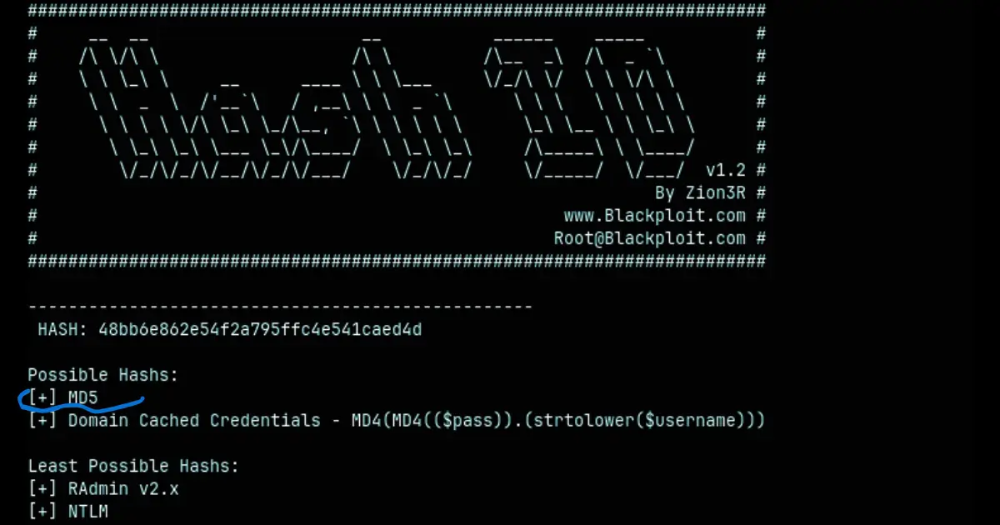
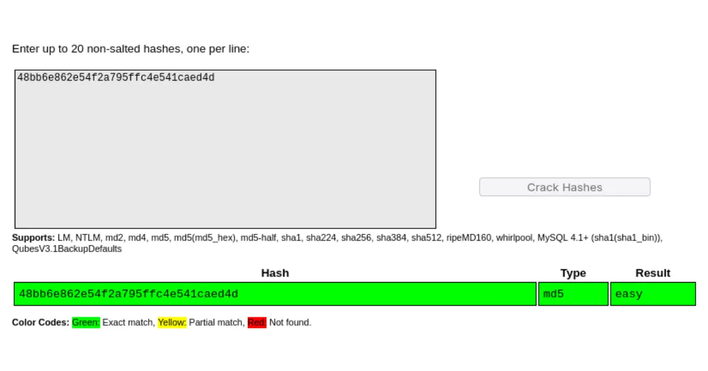

+++
date = '2025-08-13T22:53:16+03:00'
title = 'Crack the Hash Write Up'
draft = false
tags = ['tryhackme', 'hash cracking']
authors = ['msio']
thumbnail = 'images/thumbnail/cth-thumbnail.webp'
category = 'hash cracking'
excerpt = 'This is a write-up of TryHackMe’s crackthehash challenge. The room was created by ben and it involves identifying and cracking series of hashes. It consists of 2 tasks, and a total of 9 questions.'
featured = true
+++

This is a write-up of **TryHackMe's** [crackthehash](https://tryhackme.com/r/room/crackthehash) challenge.
The room was created by [ben](https://tryhackme.com/r/p/ben) and it involves identifying and cracking series of hashes. It consists of 2 tasks, and a total of 9 questions.

For this challenge, you'll need a hash identifier & hash cracker, you can use:
- [hashes.com](https://hashes.net/)
- [crackstation.net](https://crackstation.net/)

Or you can download:
- Hash Crackers ([hashcat](https://hashcat.net/hashcat/) or [johntheripper](https://github.com/openwall/john.git))
- Hash Identifiers ([github/psypanda](https://github.com/psypanda/hashID.git) or [github/blackploit](https://github.com/blackploit/hash-identifier.git))


## TASK 1:
Can you complete the level 1 tasks by cracking the hashes?

#### Question 1.
MD5 Hash: _**`48bb6e862e54f2a795ffc4e541caed4d`**_

Using *hashid & hashcat*
```sh
 $ python hash-id.py
```



```shell
$ echo '48bb6e862e54f2a795ffc4e541caed4d' > hashes.txt
$ ./hashcat -m 0 hashes.txt rockyou.txt
    ...
# -m 0 specifies the type of hash
# 0 is the unique id of the MD5. hash

$ ./hashcat -m 0 --show hashes.txt
48bb6e862e54f2a795ffc4e541caed4d:easy
```

Using *crackstation*:


- For the rest of the post, I'll be using `hashcat` for cracking the hash
- Also the flags won't be displayed.
- You can follow along with this or you can use the online tools, links provided above.


#### Question 2.
SHA-1 Hash: _**`CBFDAC6008F9CAB4083784CBD1874F76618D2A97`**_

```shell
$ python hash-id.py
--------------------------------------------------
 HASH: CBFDAC6008F9CAB4083784CBD1874F76618D2A97

Possible Hashs:
[+] SHA-1
    ...
[+ --OUTPUT REDACTED-- +]
--------------------------------------------------
```

> [!Tip]
> You can find the unique id of a hash with the following command
> `$ ./hashcat --help | grep [HASH_TYPE]`

```shell
$ ./hashcat --help | grep SHA1
    100 | SHA1                           | Raw Hash
    150 | HMAC-SHA1 (key = $pass)        | Raw Hash authenticated
    160 | HMAC-SHA1 (key = $salt)        | Raw Hash authenticated
    ...

$ echo 'CBFDAC6008F9CAB4083784CBD1874F76618D2A97' > hashes.txt
$ ./hashcat -m 100 hashes.txt rockyou.txt
    ...

$ ./hashcat -m 100 --show hashes.txt
cbfdac6008f9cab4083784cbd1874f76618d2a97:***********
```


#### Question 3.
SHA-256 Hash: _**`1C8BFE8F801D79745C4631D09FFF36C82AA37FC4CCE4FC946683D7B336B63032`**_

```shell
$ python hash-id.py
--------------------------------------------------
 HASH: 1C8BFE8F801D79745C4631D09FFF36C82AA37FC4CCE4FC946683D7B336B63032

Possible Hashs:
[+] SHA-256
    ...
--------------------------------------------------

$ echo '1C8BFE8F801D79745C4631D09FFF36C82AA37FC4CCE4FC946683D7B336B63032' > hashes.txt
$ ./hashcat -m 1400 hashes.txt rockyou.txt
    ...

$ ./hashcat -m 1400 --show hashes.txt
1c8bfe8f801d79745c4631d09fff36c82aa37fc4cce4fc946683d7b336b63032:*******
```


#### Question 4.
Bcrypt Hash: _**`$2y$12$Dwt1BZj6pcyc3Dy1FWZ5ieeUznr71EeNkJkUlypTsgbX1H68wsRom`**_

```shell
$ echo '$2y$12$Dwt1BZj6pcyc3Dy1FWZ5ieeUznr71EeNkJkUlypTsgbX1H68wsRom' > hashes.txt

$ ./hashid.py hashes.txt
--File 'hashes.txt'--
Analyzing '$2y$12$Dwt1BZj6pcyc3Dy1FWZ5ieeUznr71EeNkJkUlypTsgbX1H68wsRom'
[+] Blowfish(OpenBSD) 
[+] Woltlab Burning Board 4.x 
[+] bcrypt 
--End of file 'hashes.txt'--

$ ./hashcat --help | grep 'Blowfish'
   3200 | bcrypt $2*$, Blowfish (Unix)                     | Operating System
    ...

# Use --skip to specify the number of password candidates to skip
$ ./hashcat -m 3200 hashes.txt rockyou.txt --skip=100000
    ...

$ ./hashcat -m 3200 --show hashes.txt
$2y$12$Dwt1BZj6pcyc3Dy1FWZ5ieeUznr71EeNkJkUlypTsgbX1H68wsRom:****
```


#### Question 5.
MD4 Hash: _**`279412f945939ba78ce0758d3fd83daa`**_

```shell
$ echo '279412f945939ba78ce0758d3fd83daa' > hashes.txt

$ ./hashid.py hashes.txt
--File 'hashes.txt'--
Analyzing '279412f945939ba78ce0758d3fd83daa'
[+] MD2
[+] MD4
    ...

$ ./hashcat --help | grep -i -e 'md2 \| md4'
    900 | MD4            | Raw Hash
    ...

$ ./hashcat -m 900 hashes.txt -r rules/toggles1.rule rockyou.txt -O
    ...

$ ./hashcat -m 900 --show hashes.txt
279412f945939ba78ce0758d3fd83daa:**********
```


## TASK 2
> This task increases the difficulty. All of the answers will be in the classic [rock you](https://github.com/brannondorsey/naive-hashcat/releases/download/data/rockyou.txt) password list.
> You might have to start using hashcat here and not online tools. It might also be handy to look at some example hashes on hashcats page.


#### Question 6.
SHA-256 Hash: _**`F09EDCB1FCEFC6DFB23DC3505A882655FF77375ED8AA2D1C13F640FCCC2D0C85`**_

```sh
$ echo 'F09EDCB1FCEFC6DFB23DC3505A882655FF77375ED8AA2D1C13F640FCCC2D0C85' > hashes.txt

$ ./hashid.py hashes.txt
--File 'hashes.txt'--
Analyzing 'F09EDCB1FCEFC6DFB23DC3505A882655FF77375ED8AA2D1C13F640FCCC2D0C85'
[+] Snefru-256 
[+] SHA-256
    ...

$ ./hashcat -m 1400 hashes.txt rockyou.txt
    ...

$ ./hashcat -m 1400 --show hashes.txt
f09edcb1fcefc6dfb23dc3505a882655ff77375ed8aa2d1c13f640fccc2d0c85:*****
```


#### Question 7.
NTLM Hash: _**`1DFECA0C002AE40B8619ECF94819CC1B`**_

```sh
$ ./hashid.py hashes.txt
--File 'hashes.txt'--
Analyzing '1DFECA0C002AE40B8619ECF94819CC1B'
    ...
[+] NTLM
    ...


$ ./hashcat -m 1000 hashes.txt rockyou.txt
    ...

$ ./hashcat -m 1000 --show hashes.txt
1dfeca0c002ae40b8619ecf94819cc1b:************

```


#### Question 8.
SHA-512 Hash: _**`$6$aReallyHardSalt$6WKUTqzq.UQQmrm0p/T7MPpMbGNnzXPMAXi4bJMl9be.cfi3/qxIf.hsGpS41BqMhSrHVXgMpdjS6xeKZAs02.`**_

```sh
$ echo '$6$aReallyHardSalt$6WKUTqzq.UQQmrm0p/T7MPpMbGNnzXPMAXi4bJMl9be.cfi3/qxIf.hsGpS41BqMhSrHVXgMpdjS6xeKZAs02.' > hashes.txt
$ ./hashid.py hashes.txt
--File 'hashes.txt'--
Analyzing '$6$aReallyHardSalt$6WKUTqzq.UQQmrm0p/T7MPpMbGNnzXPMAXi4bJMl9be.cfi3/qxIf.hsGpS41BqMhSrHVXgMpdjS6xeKZAs02.'
[+] SHA-512 Crypt 
--End of file 'hashes.txt'--

$ ./hashcat --help | grep -i sha512crypt
   1800 | sha512crypt $6$, SHA512 (Unix)             | Operating System
```

This hash took longer than expected to crack, so it's better to use the following options
- `--skip`: To specify the number of password candidates to skip.
- `--limit`: To specify the number of password candidates to process.
- `-a`: To specify attack mode
- Also set the number of rounds to 5000 in the hash file.

```sh
$ echo '$6$rounds=5000$aReallyHardSalt$6WKUTqzq.UQQmrm0p/T7MPpMbGNnzXPMAXi4bJMl9be.cfi3/qxIf.hsGpS41BqMhSrHVXgMpdjS6xeKZAs02.' > hashes.txt
$ ./hashcat -m 1800 -a 0 chash.txt rockyou.txt --skip=2800000 --limit=50000
    ...

$ ./hashcat -m 1800 --show chash.txt
$6$aReallyHardSalt$6WKUTqzq.UQQmrm0p/T7MPpMbGNnzXPMAXi4bJMl9be.cfi3/qxIf.hsGpS41BqMhSrHVXgMpdjS6xeKZAs02.:******
```


#### Question 9.
HMAC-SHA1: _**`e5d8870e5bdd26602cab8dbe07a942c8669e56d6`**_

```sh
echo 'e5d8870e5bdd26602cab8dbe07a942c8669e56d6:tryhackme' > hashes.txt
$ ./hashcat -m 160 hashes.txt rockyou.txt
    ...

$ ./hashcat -m 160 --show hashes.txt
e5d8870e5bdd26602cab8dbe07a942c8669e56d6:tryhackme:************
```
