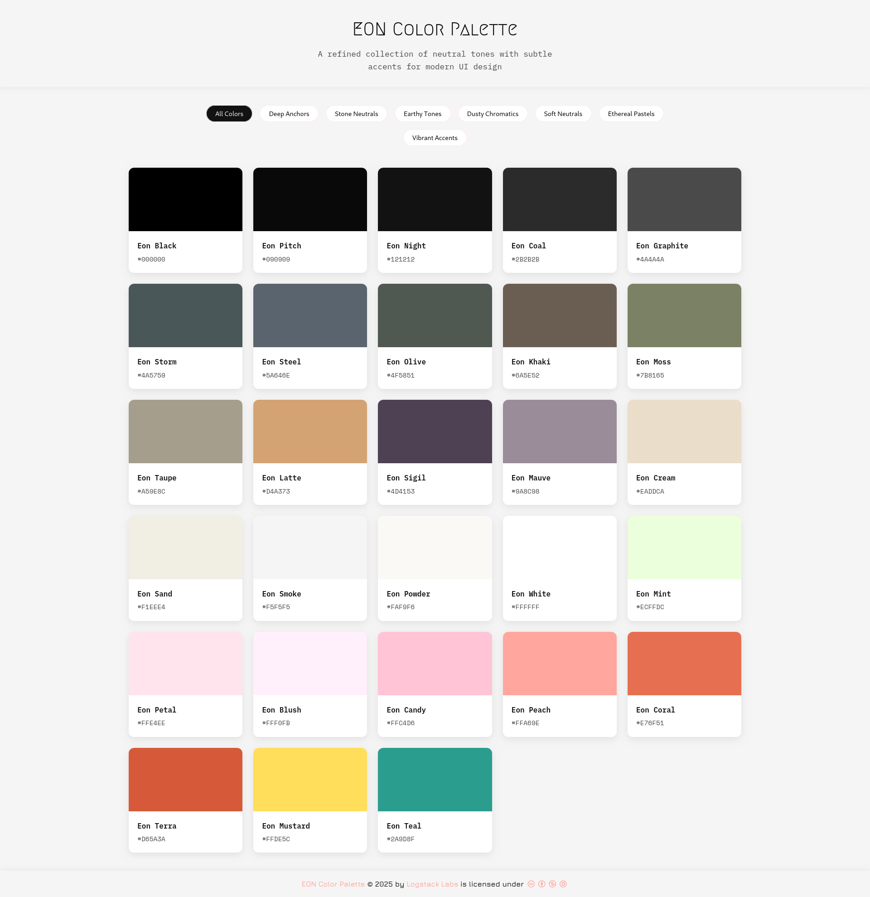

+++
date = '2025-08-17T15:55:12+03:00'
draft = false
title = 'Eon Color Palette'
tags = ['Css3', 'JavaScript', 'npmjs', 'Scss']
authors = ['msio']
thumbnail = 'images/thumbnail/eon.png'
category = 'color palette'
excerpt = 'EON is a carefully curated color palette inspired by natural elements and timeless design principles for modern interface designs. It features 28 carefully selected colors organized into 7 semantic groups.'
+++

EON is a carefully curated color palette inspired by natural elements and timeless design principles for modern interface designs. It features 28 carefully selected colors organized into 7 semantic groups.
For more detailed documentation, visit the [NPM Package](https://www.npmjs.com/package/@logstack/eon) repository or the [**GitHub**](https://github.com/logstacklabs/plumeo.git) repository.
Click this [link](https://logstacklabs.github.io/eon-swatches/) to see the [color swatches](https://logstacklabs.github.io/eon-swatches/).

### 📦 Installation & Usage
```bash
# npm
npm install @logstack/eon
```

- ##### Basic Color Access
```javascript
import { EonColors, getEonColor } from '@logstack/eon';

// Direct access
const black = EonColors.black; // "#000000"
const teal = EonColors.teal;   // "#2a9d8f"

// Function access with validation
const color = getEonColor('coral'); // "#e76f51"
const invalid = getEonColor('red'); // null
```

- ##### Color Groups
```javascript { title = eon.js }
import { EonGroups, getEonGroup } from '@logstack/eon';

// Get entire color groups
const darkColors = EonGroups.deepAnchors;
// { black: "#000000", pitch: "#090909", night: "#121212", coal: "#2b2b2b" }

const accents = getEonGroup('vibrantAccents');
// { coral: "#e76f51", terra: "#d65a3a", mustard: "#ffde5c", teal: "#2a9d8f" }
```
- ##### CSS Variable Injection
```javascript { title = inject.js }
import { injectEonColors, removeEonColors } from '@logstack/eon/inject';

// Inject CSS custom properties
injectEonColors(); 
// Creates :root { --eo-black: #000000; --eo-teal: #2a9d8f; ... }

// Custom configuration
injectEonColors({
  styleId: 'my-colors',   // Custom style element ID
  replace: false          // Don't replace existing styles
});

// React component example
function Button() {
    return (
        <button style={{
            color: 'var(--eo-white)',
            backgroundColor: 'var(--eo-coral)'
        }}>
            Click Me
        </button>
    );
}

// Remove injected styles
removeEonColors();
```

- ##### CSS Variables
```css { title = eon.css }
@import '@logstack/eon/dist/eon.css';

button {
    background: var(--eo-sigil);
    border: 2px solid var(--eo-coal);
}
```

- ##### SCSS Variables
```scss { title = eon.scss }
/*
@mixin eon-colors($selector: ':root') {}    // Generate CSS variables

@function eon-color($colorName) {}          // Returns CSS styled variable, Eg: var(--eo-sigil)
@function eon-color-value($colorName) {}    // Returns Hex value of color, Eg: #4D4153
@function eon-color-group($groupName) {}    // Returns an array of colors values from specified group.
*/
@use 'sass:color';
@use '@logstack/eon/dist/eon' as eon;

@include eon.eon-colors();

.button {
    background: eon.eon-color('teal'); //? var(--eo-teal);
    border: 2px solid eon.eon-color-value('coal'); //? #2B2B2B

    &:hover {
        background: color.scale(eon.eon-color-value('teal'), $green: 44%);
    }
}

@use 'sass:map';

.tmp { 
    color: map.get($eon-color-palette, 'sigil');
}
```

- ##### Utility Functions
```javascript { title = eon.js }
import { 
  getAllColorNames, 
  getAllGroupNames, 
  getColorsByGroup,
  isValidEonColor 
} from '@logstack/eon';

const allColors = getAllColorNames(); 
// ['black', 'pitch', 'night', ...]

const groups = getAllGroupNames(); 
// ['deepAnchors', 'stoneNeutrals', ...]

const earthyColors = getColorsByGroup('earthyTones'); 
// ['olive', 'khaki', 'moss', 'taupe', 'latte']

const isEonColor = isValidEonColor('#2a9d8f'); // true
```

- ##### JSON
```json { title = eon.json }
{
  "version": "1.0.0",
  "colors": {
    "black": "#000000",
    "pitch": "#090909",
    // ...
  },
  "groups": {
    "deepAnchors": {
      "black": "#000000",
      "pitch": "#090909",
      // ...
    }
    // ...
  }
}
```

### 📚 API Reference

```javascript
// Core functions
getEonColor(colorName: string): string | null
getEonGroup(groupName: string): Record<string, string> | null

getAllColorNames(): string[]
getAllGroupNames(): string[]
getColorsByGroup(groupName: string): string[] | []

isValidEonColor(colorName: string): boolean
isEonColorsInjected(styleId: string): boolean
removeEonColors(styleId: string): boolean;  // Removes CSS variables
injectEonColors(options: Record<string, string>): boolean;  // Injects CSS variables

// Core objects
EonColors: Record<string, string>
EonGroups: Record<string, Record<string, string>>
```


### 🎨 Color Palette & Groups List

1. **Deep Anchors**:
   - _Color_: black, pitch, night, coal
   - _Usage_: Text, dark backgrounds
2. **Stone Neutrals**:
   - _Color_: graphite, storm, steel
   - _Usage_: Borders, disabled states
3. **Earthy Tones**:
   - _Color_: olive, khaki, moss, taupe, latte
   - _Usage_: Natural UI elements
4. **Dusty Chromatics**:
   - _Usage_: plum, mauve
   - _Usage_: Secondary accents
5. **Soft Neutrals**:
   - _Color_: cream, sand, smoke, powder, white
   - _Usage_: Backgrounds, light surfaces
6. **Ethereal Pastels**:
   - _Color_: mint, petal, blush, candy, peach
   - _Usage_: Highlights, delicate accents
7. **Vibrant Accents**:
   - _Color_: coral, terra, mustard, teal
   - _Usage_: CTAs, important elements

#### Full Color Reference
[](https://logstacklabs.github.io/eon-swatches/)

### 🤝 Contributing
[](CODE_OF_CONDUCT.md)
- Check out this guide [link](https://daily.dev/blog/how-to-contribute-to-open-source-github-repositories)
- Also makesure to record your changes in the [changelog](CHANGELOG.md) file.

### 📜 License
MIT License © 2025 [Logstack Labs](https://logstack.dev). See [LICENSE](https://github.com/logstacklabs/eon/blob/main/LICENSE) for details.

### 🙏 Acknowledgements
EON was made possible with help from:
- [Canva](https://www.canva.com/colors/color-wheel/)
- [Shields.io](https://shields.io)
- [Coolors.co](https://coolors.co)
- [SASS/SCSS](https://sass-lang.com)
- [Vitest Docs](https://vitest.dev/guide/)
- [MIT](https://opensource.org/license/mit)
- [TS Docs](https://www.typescriptlang.org/docs/)
---

> [!Quote]
> "Colors are the smiles of nature." - Leigh Hunt
